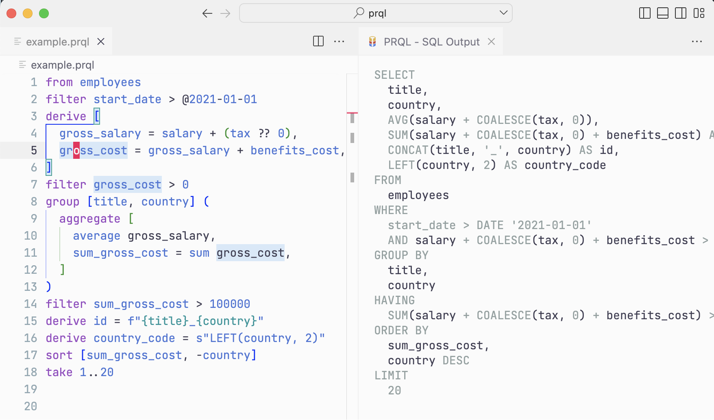

# PRQL extension for Visual Studio Code

PRQL is a modern language for transforming data — a simple, powerful, pipelined SQL replacement.

The VSCode extension:

- Provides syntax highlighting for PRQL
- Offers a SQL Output Panel, which updates on every keypress

Here's an example:

